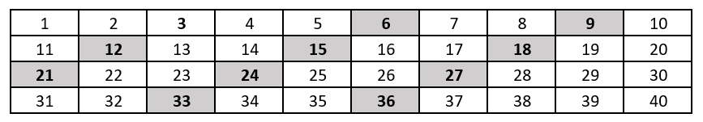
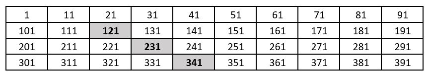
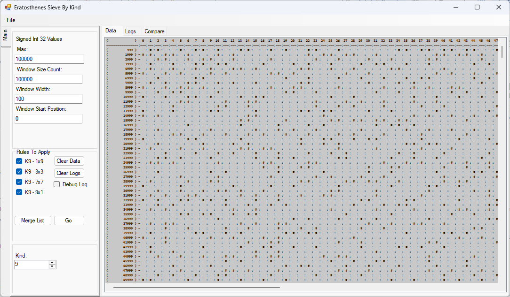

Some comments here delve into math behind the sieve, or merging of rays. These things are not directly part of any output, and are largely considered unimportant under the hood, though the do exist and get computed. Sieve only :(  

# Eratosthenes Sieve By Kind

Eratosthenes Sieve is the early concept that multiples could be filtered from the expanse of numbers, to catch or capture only prime numbers in the end. To do this, numbers are arranged linearly or in a grid, and multiples are able to be struck off rather handily. 

The first easy to view example, would be crossing off multiples of 3:

Eratosthenes discovered all that was required to determine which numbers are multiples of three, is to cross-off every third number on the list after three. This makes the numbers that are crossed off, inherently not-prime. Whether the numbers are arranged in a line or a grid, a pattern ensues to the end.

The Eratosthenes Sieve project, is a small variation on the above concept. Instead of focusing on the width-and-breadth of all numbers, it makes use of four smaller sieves in attempt to reduce the load. 

The project takes advantage of the obvious, that after 5, there are only four kinds of prime numbers, numbers ending in:  1, 3, 7, and 9. If the goal is not to find multiples, but to find primes instead, only four numbers of every-ten matter. Further, if every non-prime number has two-or-more prime roots, and all possible multiples can be expressed by the four preserved kinds, nothing more is needed from the larger number-space.

To focus the sieve around all four-kinds at once, would be rather messy, making the connection of patterns difficult to see. To explain this, there are four types of multiplication, that apply to each of the remaining kinds of number.

The first of these sets is the number 1. Numbers ending with 1, can only be multiples if one of the four equations below says so:
<pre>
...1 x ...1 = 
...3 x ...7 = 
...7 x ...3 = 
...9 x ...9 = 
</pre>

Knowing the specific rules that apply to a kind, allows a properly visible, base-10, sieve to be constructed for only that kind. To state this clearly, see the table below. If it contained 1,3,7,9,11,13,17,19,... in the first row, and the corresponding patterns of all four kinds, it would still work, but be more difficult to contemplate conceptually. 

A simple example, might be crossing off multiples of 11, in a Kind-1 table:

Compressing the table in this manner, and focusing on few equations at a time, had the added advantage of increasing the scope of computable numbers by a power of ten, without increasing overhead. The app is clunky and UI bound, but does succeed at finding the first primes of a kind, quicker than say, attempting to divide. 

The concept of Eratosthenes sieve, is that of crossing off every-nth element. Strangely, you can see this preserved in the grid above, even though it has been compressed by a power of ten. There is another peculiarity that persists, in that the rise-and-run in a grid that is power-of-ten wide, can be found in the base number itself. Encoded in the number, is the path. 11 x 11, 11 x 21, 11 x 31, ... follow the path, rise-1, run-1. 

--

What you will notice for numbers ending in 1, is that the equations contain two-sets of square producing equations:

<pre>...1 x ...1 and ...9 x ...9</pre>

Without taking things too far, each series of equations (for instance 11 x Kind-1), produces a pattern that can be called a ray. A ray is simply a line, that has a beginning, continues forever, and has no end. Every point along the path is a multiple.

What it means, for such an equation to produce squares, is that Kind-1 and Kind-9, should produce more primes than Kind-3 or Kind-7. By deductive reasoning, we can study the square rays briefly. Each ray containing its own square, also contains its own cube, quad, etcetera. What these represent, are independent, and diverging rays, that recoalesce on the same points with regular frequency. Meaning, more of their multiples are redundant. In areas where multiple square or cube containing rays themselves coalesce, there should be a surplus of primes in the nearby sievable area. Frankly, there are a finite number of rays that have been emitted upto any particular number in space. If multiple rays are colliding, particularly at super-junctions, such as when cinque combines with its own quad, cube, and square (four rays in one place), there are fewer rays to consume the surrounding neighbors. 

This may explain some of the alure of Fermat's 2N + 1 and Messene's 2N - 1. If the full Eratosthenes sieve were used, including all numbers, even and odd, 2N is not a random number or ray. 2N is a both the point on a ray belonging to N, the emerging origin point of a new ray that will not cross again until 2N+1, and only at the very precise point where all pre-existing child-rays of 2N coalesce with it. A ray 2N, will always emerge on ray N, and will always land on points along with all 2N rays 21 - 2N-1. This is important. 

What I am saying, is their equations are much broader in implication, when considered as rays in an Eratosthenes sieve. The implication is that 3N+/-1 and 4N+/-1, or any considerably useful base, should exhibit the same qualities and characteristics of 2N+/-1. Furthermore, once considered as rays, it is possible to logically conceive that 2N+/-3, should have a lower yield rate that 2N+/-1, but still have a higher yield rate than average. This is due to the localized vacuum of multiples created, when many rays combine at the same location. Namely nN rays (squares, cubes, quads, so-on).

I do not know for sure, but I suspect there are special occurrences, where multiple K1 x K1 squares combine and cross multiple K9 x K9 squares, making these bountiful zones. Forecasting and projecting that though, could be difficult. The same could be said of the square equations associated with Kind-9, ...3 x ...3 and ...7 x ...7. I have not found an example yet, but if these rays did not intercept, it would mean they are parallel. 

## Basic Usage

Important fields getting started are Max (at the top), which sets the size of the array to process, and Kind (at the bottom), which enables checkboxes for specific sets of functions to run against one-kind of number: ...1, ...3, ...7, or ...9. Running all four functions for a kind, will find all prime numbers of that kind, upto Max * 10. Remember, max is the size of the array, where the numbers are a power of ten larger.

Window settings control which portion of results will be in view. Sorry, it is not readily reloadable. The UI will reliably handle 1M values displayed, beyond that things can slow. Use Window Start and Window Size, to determine where display should begin, and how many to show. Window Width is more interesting. Depending upon the functions you are running, window width can be modified to represent powers of 10 or common multiples, to manipulate the paths of rays without changing accuracy of output. It is an optical patterning thing.

Go is the first option of buttons, it will run only the selected functions for the selected kind, and display results. Merge List, will run all functions, for all kinds, merge their results, and output a plain-text file of primes (at the expense of running over four-times longer). Well, upto int 32, or while memory holds out. The files get large and useless quickly. This is really meant for study.

It will eventually finish, if allowed to. That's what it does. Personally, I do not recommend looking for anything larger than the first 10-million or so of a Kind. Anything beyond that, runs out of scope for what is feasible. 

Numbers to the left of data in the display, are not-quite row-numbers, they are the last numeric value that falls in a given row. 

The workload does bog-down as size increases. And, it is well worth noting that completion time slows down at a growing rate. The time it takes to calculate on 1,000,000 items, is substantially longer than the time it takes to calculate on 100,000 (x 10). 

## For Coders

A couple odd rules apply. No ray ever comes from 1, it defeats the purpose. Therefore, all ...1 x ... and ... x ...1 equations, consider the lowest  multiplier to be 11 at the outset. 

Additionally, ...3 x ...7 is not the same thing as ...7 x ...3. They produce different results. You must run both when looking for only primes. If you want to know, matrix multiplication is non-commutative. Meaning simply, that they cannot be reversed in the way singular expression multiplication can. To take 13 x all of Kind-7, produces a set of results, all of them right. However, all of Kind-7 x 13 also produces a set, containing some results that are part of 13 x K7, and missing others, also all right results for the condition. There is substantial overlap in the results, but not absolute. Look at it this way, in the sieve for K3 x K7, every third-item is crossed off. In the sieve for K7 x K3, every seventh item is crossed off. Every seventh is clearly not the same as every third, they are allowed to miss often, and both still be right.

 
 
