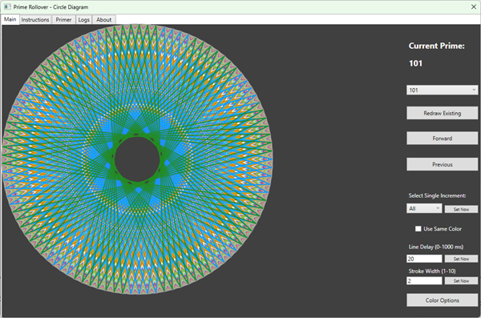
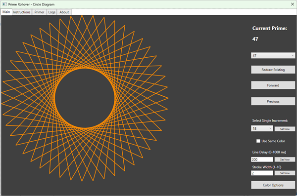
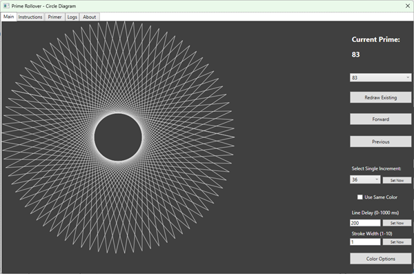
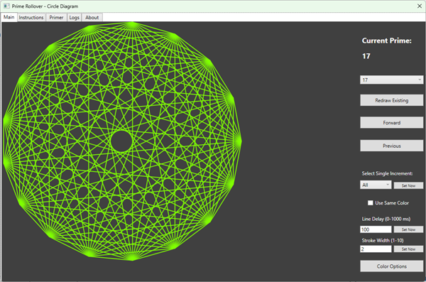
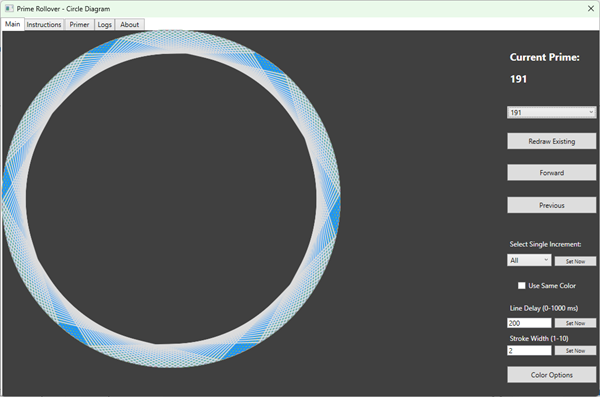
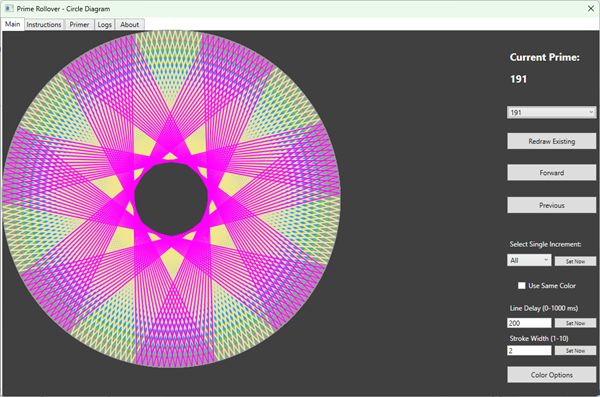

# Prime Rollover - Circle Diagram

The purpose of this app, is to visually illustrate Prime Rollover as a product of the indivisibility of primes. In default configuration, each color represents attempting to divide the prime by a different value.

Instructions are included in-app, along with a rough description of what is being shown. For executables only, download the files and images from the directory marked "RunFolder", the other app-named directory contains buildable C# sources for this WPF application.
 

Below are images of the app in-action, showing what it visibly looks like when trying to divide a prime.

 

 
 

 
 

 
 

 
 

 
 

 
 

